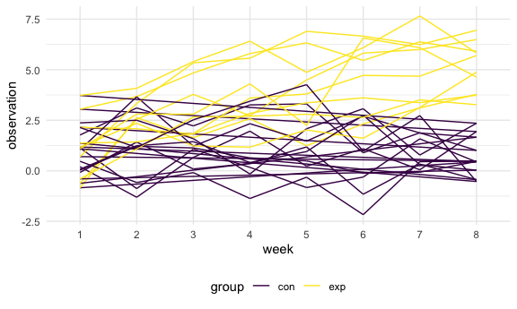
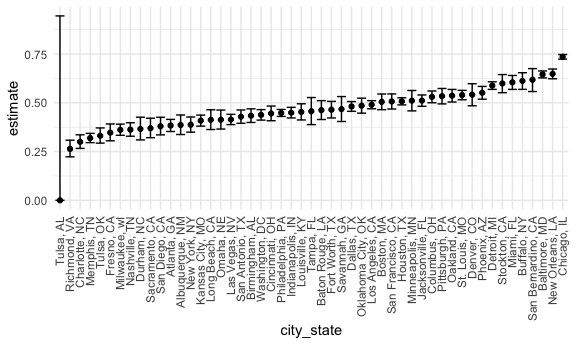
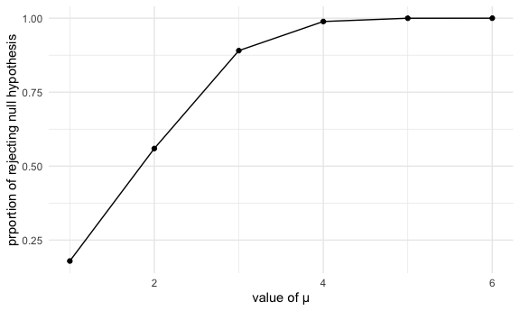

p8105_hw5_yx2710
================

``` r
library(tidyverse)
```

    ## ── Attaching packages ─────────────────────────────────────── tidyverse 1.3.2 ──
    ## ✔ ggplot2 3.3.6      ✔ purrr   0.3.4 
    ## ✔ tibble  3.1.8      ✔ dplyr   1.0.10
    ## ✔ tidyr   1.2.1      ✔ stringr 1.4.1 
    ## ✔ readr   2.1.2      ✔ forcats 0.5.2 
    ## ── Conflicts ────────────────────────────────────────── tidyverse_conflicts() ──
    ## ✖ dplyr::filter() masks stats::filter()
    ## ✖ dplyr::lag()    masks stats::lag()

``` r
knitr::opts_chunk$set(
  fig.width = 6,
  fig.asp = .6,
  out.width = "90%",
  echo = TRUE
)
theme_set(theme_minimal() + theme(legend.position = "bottom"))
options(
  ggplot2.continuous.colour = "viridis",
  ggplot2.continuous.fill = "viridis"
)
scale_colour_discrete = scale_color_viridis_d
scale_fill_discrete = scale_fill_viridis_d
```

\#Problem 1 - list

``` r
All_names = list.files("data/")
```

``` r
all_df = 
  tibble(all_names = list.files("data")) %>%
  mutate(file_contents = purrr::map(all_names, ~ read_csv(file.path("./data", .)))) %>% 
  mutate(names = str_remove(all_names, ".csv")) %>% 
  select(names,file_contents) %>% 
  separate(col = names, into = c("group", "id"), sep = "_")
```

    ## Rows: 1 Columns: 8
    ## ── Column specification ────────────────────────────────────────────────────────
    ## Delimiter: ","
    ## dbl (8): week_1, week_2, week_3, week_4, week_5, week_6, week_7, week_8
    ## 
    ## ℹ Use `spec()` to retrieve the full column specification for this data.
    ## ℹ Specify the column types or set `show_col_types = FALSE` to quiet this message.
    ## Rows: 1 Columns: 8
    ## ── Column specification ────────────────────────────────────────────────────────
    ## Delimiter: ","
    ## dbl (8): week_1, week_2, week_3, week_4, week_5, week_6, week_7, week_8
    ## 
    ## ℹ Use `spec()` to retrieve the full column specification for this data.
    ## ℹ Specify the column types or set `show_col_types = FALSE` to quiet this message.
    ## Rows: 1 Columns: 8
    ## ── Column specification ────────────────────────────────────────────────────────
    ## Delimiter: ","
    ## dbl (8): week_1, week_2, week_3, week_4, week_5, week_6, week_7, week_8
    ## 
    ## ℹ Use `spec()` to retrieve the full column specification for this data.
    ## ℹ Specify the column types or set `show_col_types = FALSE` to quiet this message.
    ## Rows: 1 Columns: 8
    ## ── Column specification ────────────────────────────────────────────────────────
    ## Delimiter: ","
    ## dbl (8): week_1, week_2, week_3, week_4, week_5, week_6, week_7, week_8
    ## 
    ## ℹ Use `spec()` to retrieve the full column specification for this data.
    ## ℹ Specify the column types or set `show_col_types = FALSE` to quiet this message.
    ## Rows: 1 Columns: 8
    ## ── Column specification ────────────────────────────────────────────────────────
    ## Delimiter: ","
    ## dbl (8): week_1, week_2, week_3, week_4, week_5, week_6, week_7, week_8
    ## 
    ## ℹ Use `spec()` to retrieve the full column specification for this data.
    ## ℹ Specify the column types or set `show_col_types = FALSE` to quiet this message.
    ## Rows: 1 Columns: 8
    ## ── Column specification ────────────────────────────────────────────────────────
    ## Delimiter: ","
    ## dbl (8): week_1, week_2, week_3, week_4, week_5, week_6, week_7, week_8
    ## 
    ## ℹ Use `spec()` to retrieve the full column specification for this data.
    ## ℹ Specify the column types or set `show_col_types = FALSE` to quiet this message.
    ## Rows: 1 Columns: 8
    ## ── Column specification ────────────────────────────────────────────────────────
    ## Delimiter: ","
    ## dbl (8): week_1, week_2, week_3, week_4, week_5, week_6, week_7, week_8
    ## 
    ## ℹ Use `spec()` to retrieve the full column specification for this data.
    ## ℹ Specify the column types or set `show_col_types = FALSE` to quiet this message.
    ## Rows: 1 Columns: 8
    ## ── Column specification ────────────────────────────────────────────────────────
    ## Delimiter: ","
    ## dbl (8): week_1, week_2, week_3, week_4, week_5, week_6, week_7, week_8
    ## 
    ## ℹ Use `spec()` to retrieve the full column specification for this data.
    ## ℹ Specify the column types or set `show_col_types = FALSE` to quiet this message.
    ## Rows: 1 Columns: 8
    ## ── Column specification ────────────────────────────────────────────────────────
    ## Delimiter: ","
    ## dbl (8): week_1, week_2, week_3, week_4, week_5, week_6, week_7, week_8
    ## 
    ## ℹ Use `spec()` to retrieve the full column specification for this data.
    ## ℹ Specify the column types or set `show_col_types = FALSE` to quiet this message.
    ## Rows: 1 Columns: 8
    ## ── Column specification ────────────────────────────────────────────────────────
    ## Delimiter: ","
    ## dbl (8): week_1, week_2, week_3, week_4, week_5, week_6, week_7, week_8
    ## 
    ## ℹ Use `spec()` to retrieve the full column specification for this data.
    ## ℹ Specify the column types or set `show_col_types = FALSE` to quiet this message.
    ## Rows: 1 Columns: 8
    ## ── Column specification ────────────────────────────────────────────────────────
    ## Delimiter: ","
    ## dbl (8): week_1, week_2, week_3, week_4, week_5, week_6, week_7, week_8
    ## 
    ## ℹ Use `spec()` to retrieve the full column specification for this data.
    ## ℹ Specify the column types or set `show_col_types = FALSE` to quiet this message.
    ## Rows: 1 Columns: 8
    ## ── Column specification ────────────────────────────────────────────────────────
    ## Delimiter: ","
    ## dbl (8): week_1, week_2, week_3, week_4, week_5, week_6, week_7, week_8
    ## 
    ## ℹ Use `spec()` to retrieve the full column specification for this data.
    ## ℹ Specify the column types or set `show_col_types = FALSE` to quiet this message.
    ## Rows: 1 Columns: 8
    ## ── Column specification ────────────────────────────────────────────────────────
    ## Delimiter: ","
    ## dbl (8): week_1, week_2, week_3, week_4, week_5, week_6, week_7, week_8
    ## 
    ## ℹ Use `spec()` to retrieve the full column specification for this data.
    ## ℹ Specify the column types or set `show_col_types = FALSE` to quiet this message.
    ## Rows: 1 Columns: 8
    ## ── Column specification ────────────────────────────────────────────────────────
    ## Delimiter: ","
    ## dbl (8): week_1, week_2, week_3, week_4, week_5, week_6, week_7, week_8
    ## 
    ## ℹ Use `spec()` to retrieve the full column specification for this data.
    ## ℹ Specify the column types or set `show_col_types = FALSE` to quiet this message.
    ## Rows: 1 Columns: 8
    ## ── Column specification ────────────────────────────────────────────────────────
    ## Delimiter: ","
    ## dbl (8): week_1, week_2, week_3, week_4, week_5, week_6, week_7, week_8
    ## 
    ## ℹ Use `spec()` to retrieve the full column specification for this data.
    ## ℹ Specify the column types or set `show_col_types = FALSE` to quiet this message.
    ## Rows: 1 Columns: 8
    ## ── Column specification ────────────────────────────────────────────────────────
    ## Delimiter: ","
    ## dbl (8): week_1, week_2, week_3, week_4, week_5, week_6, week_7, week_8
    ## 
    ## ℹ Use `spec()` to retrieve the full column specification for this data.
    ## ℹ Specify the column types or set `show_col_types = FALSE` to quiet this message.
    ## Rows: 1 Columns: 8
    ## ── Column specification ────────────────────────────────────────────────────────
    ## Delimiter: ","
    ## dbl (8): week_1, week_2, week_3, week_4, week_5, week_6, week_7, week_8
    ## 
    ## ℹ Use `spec()` to retrieve the full column specification for this data.
    ## ℹ Specify the column types or set `show_col_types = FALSE` to quiet this message.
    ## Rows: 1 Columns: 8
    ## ── Column specification ────────────────────────────────────────────────────────
    ## Delimiter: ","
    ## dbl (8): week_1, week_2, week_3, week_4, week_5, week_6, week_7, week_8
    ## 
    ## ℹ Use `spec()` to retrieve the full column specification for this data.
    ## ℹ Specify the column types or set `show_col_types = FALSE` to quiet this message.
    ## Rows: 1 Columns: 8
    ## ── Column specification ────────────────────────────────────────────────────────
    ## Delimiter: ","
    ## dbl (8): week_1, week_2, week_3, week_4, week_5, week_6, week_7, week_8
    ## 
    ## ℹ Use `spec()` to retrieve the full column specification for this data.
    ## ℹ Specify the column types or set `show_col_types = FALSE` to quiet this message.
    ## Rows: 1 Columns: 8
    ## ── Column specification ────────────────────────────────────────────────────────
    ## Delimiter: ","
    ## dbl (8): week_1, week_2, week_3, week_4, week_5, week_6, week_7, week_8
    ## 
    ## ℹ Use `spec()` to retrieve the full column specification for this data.
    ## ℹ Specify the column types or set `show_col_types = FALSE` to quiet this message.

spaghetti plot

``` r
all_df %>% 
  unnest(file_contents) %>% 
  pivot_longer(
    week_1:week_8,
    names_to = "week",
    names_prefix = "week_",
    values_to = "observation"
  ) %>% 
  ggplot(aes(x = week, y = observation, group = id, color = group))+
  geom_path()
```


According to the plot, we can see that the observation value of
experiment arm is higher than the control group. What’s more, the former
one increases over time and the later one decreases a little but is more
stable.

\#Problem 2 - homicides

``` r
homicides_df = read_csv("https://raw.githubusercontent.com/washingtonpost/data-homicides/master/homicide-data.csv")
```

    ## Rows: 52179 Columns: 12
    ## ── Column specification ────────────────────────────────────────────────────────
    ## Delimiter: ","
    ## chr (9): uid, victim_last, victim_first, victim_race, victim_age, victim_sex...
    ## dbl (3): reported_date, lat, lon
    ## 
    ## ℹ Use `spec()` to retrieve the full column specification for this data.
    ## ℹ Specify the column types or set `show_col_types = FALSE` to quiet this message.

The data provided by the Washington Post and contains 52179 homocide
cases in 50 large U.S. cities. The names of the variables are uid,
reported_date, victim_last, victim_first, victim_race, victim_age,
victim_sex, city, state, lat, lon, disposition.

``` r
homicide_df_new = 
  homicides_df %>% 
  janitor::clean_names() %>% 
  mutate(
    city_state = str_c(city, state, sep = ", "),
    status = case_when(
      disposition == "Closed without arrest" ~ "unsolved",
      disposition == "Open/No arrest" ~ "unsolved",
      disposition == "Closed by arrest" ~ "solved"
    ) 
  )
```

``` r
homicide_sum_df =
  homicide_df_new %>% 
  group_by(city_state) %>% 
  summarize(hom_n = n(),
            hom_un_n = sum(status == "unsolved"))
```

``` r
homicide_bal_df = 
  homicide_df_new %>% 
  filter(city_state == "Baltimore, MD") %>% 
  summarize(
    unsolved_n = sum(status == "unsolved"),
    n = n()
  )
```

``` r
homicide_p = 
  prop.test(
    x = homicide_bal_df %>% pull(unsolved_n),
    n = homicide_bal_df %>% pull(n)
  ) 

homicide_p %>% 
  broom::tidy()
```

    ## # A tibble: 1 × 8
    ##   estimate statistic  p.value parameter conf.low conf.high method        alter…¹
    ##      <dbl>     <dbl>    <dbl>     <int>    <dbl>     <dbl> <chr>         <chr>  
    ## 1    0.646      239. 6.46e-54         1    0.628     0.663 1-sample pro… two.si…
    ## # … with abbreviated variable name ¹​alternative

run prop.test for each of the cities in your dataset

``` r
city_prop = function(city){
  city_sum = 
    city %>% 
    summarize(n = n(),
            unsolved_n = sum(status == "unsolved"))
  
  city_prop = 
    prop.test(
    x = city_sum %>% pull(unsolved_n),
    n = city_sum %>% pull(n)
  ) 
  
  return(city_prop)
}
```

``` r
all_city_test = 
  homicide_df_new %>% 
  select(city_state, everything()) %>% 
  nest(data = uid:status) %>% 
  mutate(
    city_test = purrr::map(data, city_prop),
    tidy_test = purrr::map(city_test, broom::tidy)
  ) %>% 
  select(city_state, tidy_test) %>%
  unnest(tidy_test) %>% 
  select(city_state, estimate, conf.low, conf.high)
```

    ## Warning in prop.test(x = city_sum %>% pull(unsolved_n), n = city_sum %>% : Chi-
    ## squared近似算法有可能不准

``` r
all_city_test %>%
  mutate(city_state = fct_reorder(city_state, estimate)) %>% 
  ggplot(aes(x = city_state, y = estimate))+
  geom_point()+
  geom_errorbar(aes(ymin = conf.low, ymax = conf.high))+ 
  theme(axis.text.x = element_text(angle = 90, vjust = 0.5, hjust=1))
```



\#Problem 3

``` r
set.seed(1640)
```

``` r
t_test = function(n, mu = 0, sigma = 5){
  t_data = tibble(
    x = rnorm(n, mean = mu, sd = sigma)
  )
  
  t_data %>% 
    t.test(mu = 0, conf.level = 0.95) %>% 
    broom::tidy()
}
```

``` r
t_test(30)
```

    ## # A tibble: 1 × 8
    ##   estimate statistic p.value parameter conf.low conf.high method         alter…¹
    ##      <dbl>     <dbl>   <dbl>     <dbl>    <dbl>     <dbl> <chr>          <chr>  
    ## 1    -1.56     -1.77  0.0868        29    -3.36     0.240 One Sample t-… two.si…
    ## # … with abbreviated variable name ¹​alternative

``` r
output = vector("list", 5000)

for (i in 1:5000) {
  output[[i]] = t_test(30) 
}

sim_results = bind_rows(output)
```

``` r
sim_results_df = 
  expand_grid(
    mu_all = c(1,2,3,4,5,6),
    iter = 1:5000
  ) %>% 
  mutate(
    estimate_df = map(.x = mu_all, ~t_test(30, mu = .x))
  ) %>% 
  unnest(estimate_df)
```

``` r
sim_results_rej = 
  sim_results_df %>% 
  group_by(mu_all) %>% 
  summarize(rej_prop = sum(p.value < 0.05)/length(p.value))

plot_rej = 
  sim_results_rej %>% 
  ggplot(aes(x = mu_all, y = rej_prop))+
  geom_point()+
  geom_line()+
  xlab("value of μ")+
  ylab("prportion of rejecting null hypothesis")

plot_rej
```


